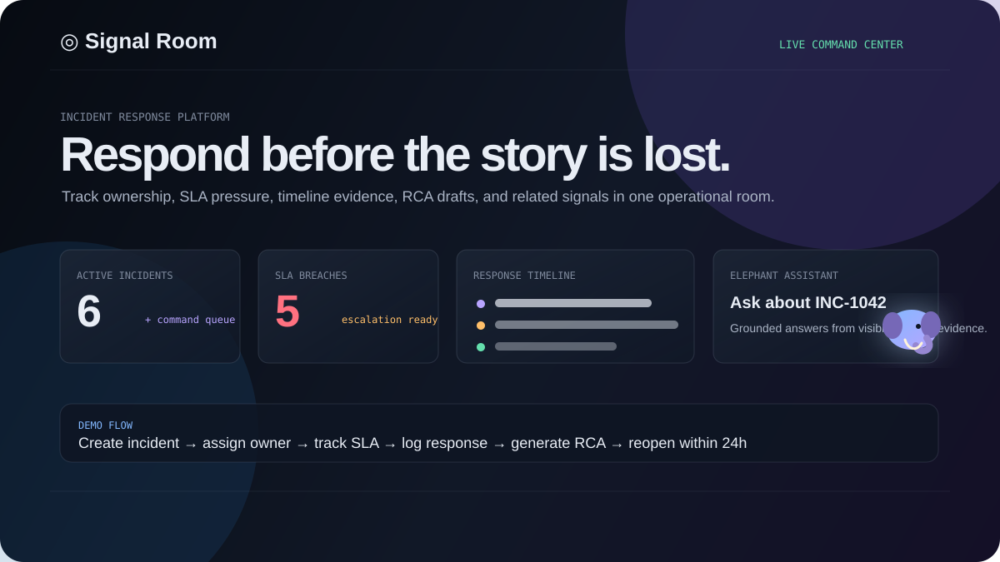
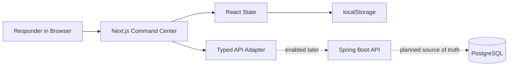

# Signal Room

<div align="center">

### An incident command center for response, RCA, and operational clarity

Signal Room helps engineering teams turn production incidents into coordinated ownership, visible decisions, SLA-aware action, and structured root-cause learning.

[](https://nextjs.org/)
[](https://www.typescriptlang.org/)
[](https://spring.io/projects/spring-boot)
[](https://github.com/Ninjja17/HandsonLab)

</div>



## What The Platform Does

Signal Room is designed for the first hour of a production incident, when teams need to quickly answer:

- What is broken?
- Who owns the response?
- How severe is the impact?
- Are we close to breaching SLA?
- What has already happened?
- What should go into the RCA?
- Are there similar incidents nearby?

Instead of a generic admin dashboard, Signal Room gives responders a focused command-center workspace with incident context, ownership, timeline evidence, SLA posture, RCA drafting, related incident signals, and a lightweight elephant assistant.

## Current Experience

| Capability | What it does |
| --- | --- |
| Incident intake | Create a new incident with title, description, severity, owner, and impacted service |
| Incident queue | Search, filter, and select incidents from a live-style operational queue |
| Lifecycle control | Move incidents through `OPEN -> INVESTIGATING -> MITIGATED -> CLOSED` |
| Guardrails | Reject invalid or expired lifecycle actions with clear feedback |
| SLA monitoring | Track P1, P2, and P3 resolution windows with breach and escalation indicators |
| Reopen window | Reopen a resolved incident within 24 hours when investigation must resume |
| War room activity | Add responder notes and keep a visible decision history |
| Response timeline | Show incident activity as an ordered operational record |
| RCA draft | Generate editable RCA content from incident details |
| Related incidents | Suggest similar incidents by shared service or incident language |
| Elephant assistant | UI-only contextual assistant that answers from visible incident evidence |
| Browser persistence | Save demo state locally so refreshes do not erase the workflow |

## SLA Rules

| Severity | Target resolution time | Platform behavior |
| --- | ---: | --- |
| P1 | 2 hours | Critical incident, high visibility, escalation ready |
| P2 | 4 hours | High-priority incident with active SLA tracking |
| P3 | 8 hours | Medium-priority incident with operational follow-up |

SLA status appears directly in the incident queue and investigation workspace. Responders can filter by within-SLA, approaching-SLA, and breached-SLA states.

## How The Current Tech Stack Works



### Demo Mode

The current running application is frontend-first:

- Next.js renders the command center.
- React state powers the incident workflow.
- `localStorage` persists incidents and activity in the browser.
- Mock assistant answers are generated locally from the selected incident.
- No API key, database, Redis, Kafka, or Docker is required for the showcase.

This keeps the client demo fast, reliable, and easy to run anywhere.

### Backend-Ready Mode

The repository also includes a scalable backend foundation:

- Spring Boot API project in `backend/`
- PostgreSQL schema managed by Flyway
- Domain model for lifecycle and 24-hour reopen rules
- Versioned API adapter in the frontend
- Redis and Kafka configuration prepared for future scale

The UI can later switch from local browser storage to the Spring Boot API by configuring `NEXT_PUBLIC_API_URL`.

## Design Language

Signal Room uses a modern operational interface inspired by Linear, Raycast, Stripe, Vercel, and Datadog:

- Asymmetric command-center layout
- Dense bento-style information architecture
- Floating contextual panels
- Glassmorphism and subtle gradients
- Hover shine and tilt interactions
- Keyboard-accessible controls
- Reduced-motion support
- Distinctive elephant assistant instead of a standard chat box

## Show It To A Client

Use this short story:

1. Open the command center.
2. Select `INC-1042` and explain customer impact, owner, SLA state, and timeline.
3. Show related incidents `INC-1043` and `INC-1044`.
4. Create a new incident and assign an owner.
5. Move it from open to investigating.
6. Add a responder note and show it in the timeline.
7. Raise an SLA escalation.
8. Generate an RCA draft and edit the recommendation.
9. Open the elephant assistant and ask, "Why is the SLA at risk?"
10. Select `INC-1035` and demonstrate the 24-hour reopen flow.

## Run Locally

Requirements: Node.js 20 or later.

```bash
npm install
npm run dev
```

Open:

```text
http://localhost:3000
```

Validate the production build:

```bash
npm run build
```

## Project Map

```text
app/
  components/elephant-assistant.tsx  contextual assistant UI
  lib/incident-api.ts                typed backend API adapter
  page.tsx                           command center workflow
  globals.css                        visual system and interactions
backend/
  src/main/java/                     Spring Boot API foundation
  src/main/resources/                application config and Flyway SQL
docs/
  assets/signal-room-preview.svg     README visual preview
  scalable-migration-plan.md         future architecture plan
docker-compose.yml                   optional local infra for backend phase
```

## What Is Ready vs Future

| Ready now | Future phase |
| --- | --- |
| Polished frontend command center | Full Spring Boot runtime deployment |
| Browser-persisted demo data | PostgreSQL as source of truth |
| UI-only elephant assistant | Real LLM integration with citations |
| SLA, RCA, timeline, and related incidents | Authentication, RBAC, Redis, Kafka, observability |
| Local/client showcase | Cloudflare frontend + Railway backend |

## License

This project is a hands-on engineering challenge implementation. See [LICENSE](LICENSE) for the repository license.
