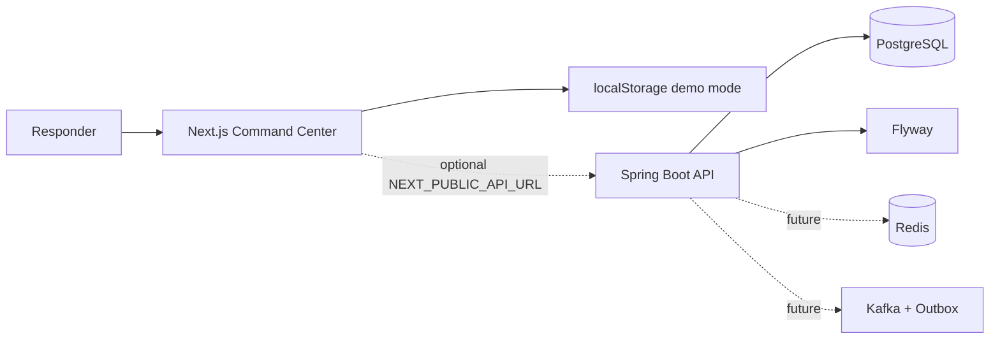

# Signal Room

<div align="center">

### Incident response, with a room to think in

An operational command center for turning production signals into coordinated action, visible decisions, and useful root-cause reports.

[](https://nextjs.org/)
[](https://www.typescriptlang.org/)
[](https://spring.io/projects/spring-boot)
[](https://github.com/Ninjja17/HandsonLab)

**[Open the repository](https://github.com/Ninjja17/HandsonLab)** · **[Try the local demo](http://localhost:3000)** · **[Read the migration plan](docs/scalable-migration-plan.md)**

</div>

> Signal Room is built for the moment after the alert fires: when a team needs to see the impact, make the next decision, and leave behind an honest record of what happened.

## The Product

Signal Room replaces the familiar dashboard maze with an asymmetric incident command center inspired by Linear, Raycast, Stripe, Datadog, and Vercel.

The interface keeps the operational story in one view:

```text
Signal -> Ownership -> Investigation -> Mitigation -> RCA -> Learning
```

It is currently a polished frontend demo with browser persistence. A Spring Boot API foundation is included for the next migration phase.

## What Works Today

| Area | Included |
| --- | --- |
| Incident control | Create, search, filter, select, assign, and update incidents |
| Lifecycle | `OPEN -> INVESTIGATING -> MITIGATED -> CLOSED` with invalid-transition protection |
| Reopen policy | Reopen a resolved incident within 24 hours |
| SLA operations | P1/P2/P3 targets, live status, breach filters, and escalation events |
| War room | Responder notes, decision activity, and synchronized response timeline |
| RCA | Local rule-based draft generation with editable fields |
| Correlation | Related-incident detection by service and shared keywords |
| Assistant | UI-only elephant companion with mock, evidence-linked answers |
| Persistence | Browser `localStorage` in demo mode |
| Interaction | Responsive layout, reduced motion, shine, tilt, and keyboard-accessible controls |

### SLA Model

| Severity | Resolution target | Demo behavior |
| --- | ---: | --- |
| P1 | 2 hours | Critical impact and immediate escalation visibility |
| P2 | 4 hours | High-priority response tracking |
| P3 | 8 hours | Medium-priority operational follow-up |

## The Demo Story

Run the demo as one connected incident narrative:

1. Open the command center and review active incidents, SLA posture, and response velocity.
2. Select `INC-1042` to reveal related checkout incidents `INC-1043` and `INC-1044`.
3. Create a new incident and assign an incident commander.
4. Move it through the controlled lifecycle.
5. Add a responder note and show it in the activity stream and decision timeline.
6. Open the elephant assistant and ask why the SLA is at risk.
7. Generate and edit the RCA draft.
8. Raise an SLA escalation and show the recorded timeline event.
9. Select `INC-1035` and demonstrate the 24-hour reopen window.

## UI Direction

- No generic admin dashboard or left-sidebar template
- Asymmetric command-center composition
- Dense bento information architecture
- Floating contextual panels
- Glass surfaces and restrained gradients
- Keyboard-first interactions
- Contextual elephant assistant instead of a conventional chat drawer
- Motion used to communicate state, focus, and attention

## Architecture



### Current Mode

The browser runs independently with seeded incidents and `localStorage`. This is the recommended mode for the client showcase because it needs no database, Docker, Redis, Kafka, or LLM credentials.

### Scalable Foundation

The repository also contains:

- Spring Boot 3.4 API foundation
- PostgreSQL 16 schema and Flyway migration
- REST endpoints under `/api/v1/incidents`
- Domain-owned lifecycle and reopen rules
- Redis and Kafka integration configuration
- Transactional outbox schema foundation
- OpenTelemetry-ready Actuator configuration

## Run Locally

Requirements: Node.js 20+.

```bash
npm install
npm run dev
```

Open [http://localhost:3000](http://localhost:3000).

Validate the production bundle:

```bash
npm run build
```

## Backend Foundation

The API boundary is ready for the next phase:

```text
GET   /api/v1/incidents
GET   /api/v1/incidents/{incidentId}
POST  /api/v1/incidents
PATCH /api/v1/incidents/{incidentId}
POST  /api/v1/incidents/{incidentId}/transitions
```

When Docker and Maven are available:

```bash
docker compose up -d
cd backend
mvn spring-boot:run
```

To point the frontend at the API:

```text
NEXT_PUBLIC_API_URL=http://localhost:8080
```

Without that variable, the frontend remains in demo mode. PostgreSQL becomes the source of truth only after API integration is enabled; JSON is used for transport, not as the database.

## Deployment Direction

```text
GitHub repository
    |
    +--> Cloudflare Pages  (Next.js frontend)
    |
    +--> Railway           (Spring Boot API)
                              |
                              +--> Railway PostgreSQL
```

Redis and Kafka are intentionally deferred until production traffic and integration requirements justify their operational cost.

## Repository Map

```text
app/
  components/elephant-assistant.tsx  UI-only contextual assistant
  lib/incident-api.ts                typed backend adapter
  page.tsx                           command center and workflows
  globals.css                        visual system and motion
backend/
  src/main/java/                     Spring Boot domain and API layers
  src/main/resources/                runtime configuration and Flyway SQL
docs/
  scalable-migration-plan.md         phase gates and deployment plan
docker-compose.yml                    local PostgreSQL/Redis/Kafka services
```

## Roadmap

- [x] Client-ready incident command center
- [x] SLA monitoring, escalation, RCA, related incidents, and reopen policy
- [x] UI-only elephant assistant prototype
- [x] Spring Boot API foundation
- [ ] Connect frontend mutations to the API
- [ ] Add authentication and workspace authorization
- [ ] Persist timeline and outbox events
- [ ] Add real LLM provider behind a read-only, cited assistant contract
- [ ] Add production observability and deployment automation

## License

This project is a hands-on engineering challenge implementation. See [LICENSE](LICENSE) for the repository license.
